# Advanced Observability & Distributed Tracing

## Overview

This lab solves a problem that metrics and logs alone cannot: **when your app is slow, which exact request caused it, which line of code ran, and how long each step took — with a single click from a Grafana graph.**

Project 6 gave you metrics (numbers over time) and logs (text events). But when a latency spike hits at 2am, metrics tell you *that* something is broken, logs tell you *what happened*, but neither tells you *why* a specific request was slow. That gap is **distributed tracing**.

This project extends the containerised Node.js/Express app with four new capabilities:

- **OpenTelemetry SDK** instruments every HTTP request automatically — no manual span creation per route. Every inbound request gets a trace with child spans for each middleware layer, measuring exact timing per step.
- **Jaeger** receives and stores those traces, giving you a searchable UI where you can find any request by service, operation, duration, or trace ID.
- **Prometheus Exemplars** embed a `traceId` inside histogram metric samples. Grafana reads them and renders clickable diamond markers on the latency graph — click a spike, land on the exact Jaeger trace that caused it.
- **Loki + Promtail** aggregates all container logs centrally. Promtail reads Docker's log socket, parses the JSON log lines, and ships them to Loki with `trace_id` as an indexed label. Grafana's `derivedFields` config turns every `trace_id` value in a Loki log line into a one-click link that opens the full Jaeger trace.

The result is a four-way correlation: a Grafana alert fires → click an exemplar diamond → Jaeger shows the exact slow span → click "View Trace in Jaeger" from the matching Loki log line. **Symptom to root cause in three clicks, entirely inside Grafana.**

---

## Objectives

- Add OpenTelemetry SDK with auto-instrumentation to an existing Express app — zero manual span creation
- Export traces to Jaeger via OTLP HTTP on port 4318
- Inject `trace_id` and `span_id` into every structured JSON log line via `AsyncLocalStorage`
- Enable Prometheus exemplars on the latency histogram — embed `traceId` and `spanId` in metric samples
- Provision Jaeger datasource in Grafana and wire `exemplarTraceIdDestinations` to create metric→trace links
- Add Loki + Promtail for centralised log aggregation — Promtail reads Docker's log socket and ships parsed JSON logs to Loki
- Configure Grafana Loki datasource with `derivedFields` to render trace_id values as clickable Jaeger links
- Tighten alert thresholds: p95 latency > 300ms and error rate > 5% both sustained for 10 minutes
- Validate with a sustained load test: alert fires → exemplar clicked → trace found → Loki log line → Jaeger trace in one click

---

## Tools & Versions

| Tool | Version |
|---|---|
| Node.js | 18-alpine |
| Express | 4.18.2 |
| prom-client | 15.1.0 |
| @opentelemetry/sdk-node | ^0.57.0 |
| @opentelemetry/auto-instrumentations-node | ^0.57.0 |
| @opentelemetry/exporter-trace-otlp-http | ^0.57.0 |
| Prometheus | v2.51.0 |
| Grafana | 10.4.0 |
| Jaeger | 1.57 (all-in-one) |
| Loki | 3.4.1 |
| Promtail | 3.4.1 |
| Node Exporter | v1.7.0 |
| Docker Compose | v2 |
| OS (local) | macOS |

---

## Problem This Lab Solves

Running a containerised app with only metrics and logs leaves a critical gap:

- **Metrics show symptoms, not causes** — p95 latency at 500ms tells you something is slow, not which request or which code path
- **Logs show events, not timing** — a log line at 14:32:01 shows an error happened, not that it was step 3 of 5 that took 490ms
- **No request-level correlation** — you cannot connect a Grafana alert to a specific log line without manually searching by timestamp
- **Manual trace hunting** — without trace IDs in logs, finding the relevant request in thousands of log lines is guesswork

OpenTelemetry + Jaeger + Prometheus Exemplars eliminates all four. Every request gets a `trace_id` that flows through spans, metrics, and log lines — one ID connects all three observability pillars.

---

## Architecture

```
YOUR MACHINE — Docker Compose
│
├── node-app (port 3000)
│   ├── tracing.js  ← OTel SDK starts here, patches http before Express loads
│   ├── logger.js   ← reads active span via AsyncLocalStorage, injects trace_id/span_id
│   ├── metrics.js  ← Histogram with enableExemplars, observes {traceId, spanId}
│   └── app.js      ← Express routes with structured JSON logging on every request
│         │                          │
│         │  OTLP HTTP               │  stdout JSON logs (Docker json-file driver)
│         │  (spans → port 4318)     │
│         ▼                          ▼
├── jaeger (ports 16686 / 4317 / 4318)      ◄── promtail (reads /var/run/docker.sock)
│   └── all-in-one: collector + query +              │
│       UI + in-memory store                         │  POST /loki/api/v1/push
│         │                                          ▼
│         │  Jaeger datasource (uid: jaeger)   ├── loki (port 3100)
│         ▼                          ▲               │  stores & indexes logs
├── grafana (port 3001)              │               │  label: container, level, trace_id
│   ├── Prometheus datasource        │               │
│   │   exemplarTraceIdDestinations ─┘               │  Loki datasource + derivedFields
│   ├── Loki datasource ─────────────────────────────┘  trace_id → "View Trace in Jaeger"
│   └── Dashboard: RED metrics + Latency Exemplars + Jaeger traces panel
│         ▲
│         │  scrapes /metrics every 15s (exemplar-storage enabled)
├── prometheus (port 9090)
│   ├── --enable-feature=exemplar-storage
│   ├── alert_rules.yml — HighErrorRate >5% / HighLatency p95>300ms / AppDown
│   └── scrapes: node-app:3000 / node-exporter:9100 / localhost:9090
│
└── node-exporter (port 9100)
      └── host CPU, memory, disk, network metrics

Correlation flow:
  Grafana alert (metric spike)
    → click exemplar diamond ◆ on latency graph
    → Jaeger trace (exact request, all spans, per-step timing)
    → Grafana Explore → Loki → {container="node-app"} | json
    → expand log line → click "View Trace in Jaeger" button
    → full trace opened from log, entirely inside Grafana
```

---

## Project Structure

```
advanced-monitoring/
├── app/
│   ├── src/
│   │   ├── server.js     # Entry point — requires tracing.js FIRST before anything else
│   │   ├── tracing.js    # OTel NodeSDK + OTLP exporter + auto-instrumentations
│   │   ├── logger.js     # Structured JSON logger — injects trace_id + span_id per line
│   │   ├── metrics.js    # prom-client OpenMetrics registry + exemplar-enabled histogram
│   │   └── app.js        # Express routes: /, /health, /api/items, /api/slow, /api/error
│   ├── Dockerfile        # Multi-stage build, COPY --chown (no RUN chown -R), non-root user
│   └── package.json      # OTel SDK + prom-client + Express dependencies
├── prometheus/
│   ├── prometheus.yml    # Scrape config — 15s interval, three jobs
│   └── alert_rules.yml   # HighErrorRate >5% 10m / HighLatency p95>300ms 10m / AppDown 1m
├── grafana/
│   ├── provisioning/
│   │   ├── datasources/
│   │   │   └── datasources.yml  # Prometheus + Jaeger + Loki (with derivedFields)
│   │   └── dashboards/
│   │       └── dashboard.yml    # File-based dashboard provisioner
│   └── dashboards/
│       └── app-dashboard.json   # RED metrics + exemplars panel + Jaeger traces panel
├── loki/
│   └── local-config.yaml # Loki single-process config — filesystem storage, inmemory ring
├── promtail/
│   └── promtail.yml      # Docker service discovery, JSON pipeline stages, ships to Loki
├── docker-compose.yml    # 7 services: app, jaeger, prometheus, grafana, loki, promtail, node-exporter
├── load-test.sh          # 13-minute load generator — triggers both alert thresholds
├── .env.example          # Copy to .env before first run
├── .gitignore
└── screenshots/          # 20 screenshots documenting the full validation workflow
```

---

## Prerequisites

1. Docker Desktop installed and running
2. Docker Compose v2
3. `curl` and `python3` available in terminal (for validation commands)
4. Ports free: 3000, 3001, 3100, 4317, 4318, 9090, 9100, 16686

---

## Running the Stack

### Step 1 — Environment setup

```bash
cp .env.example .env
```

Edit `.env` and fill in all three values:

```
APP_VERSION=1.0.0
GRAFANA_USER=admin
GRAFANA_PASSWORD=yourpassword
```

### Step 2 — Build and start

```bash
docker compose up --build
```

First run takes ~2 minutes — `npm install` downloads the OpenTelemetry packages (~80MB). Subsequent runs use the Docker layer cache and take under 10 seconds.

Wait for all seven services to report ready:

```
node-app      | {"level":"info","message":"server started","port":3000}
jaeger        | "msg":"Starting HTTP server","port":16686
prometheus    | msg="Server is ready to receive web requests."
grafana       | msg="HTTP Server Listen" address=[::]:3000
loki          | msg="Loki started"
promtail      | msg="Starting Promtail"
node-exporter | msg="Listening on" address=[::]:9100
```

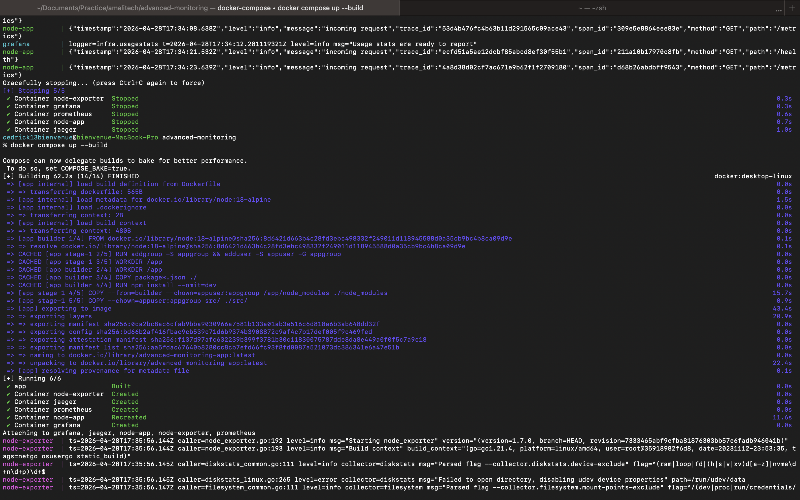

### Step 3 — Verify the app

```bash
# Slow route — returns after 300–600ms artificial delay
curl -s http://localhost:3000/api/slow | python3 -m json.tool
```

Expected response:

```json
{
    "message": "slow response",
    "delay_ms": 501
}
```

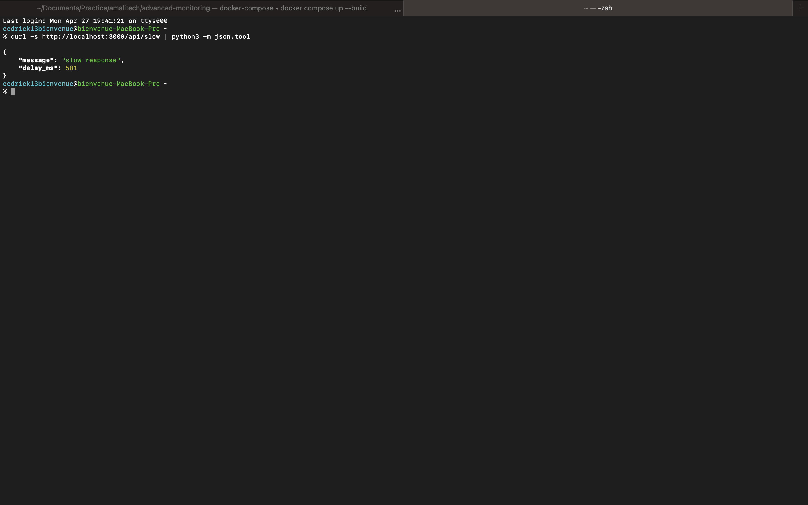

### Step 4 — Verify structured logs with trace context

```bash
docker logs node-app --tail 20
```

Every log line is a JSON object containing `trace_id` and `span_id`:

```json
{"timestamp":"2026-04-29T05:41:03.500Z","level":"info","message":"incoming request",
 "trace_id":"1711cc6b5787417a9150eda36b481d5b","span_id":"b6c92f547d430a60",
 "method":"GET","path":"/api/items"}
```

The same `trace_id` appears on every log line produced within a single request — this is the key to log-to-trace correlation.

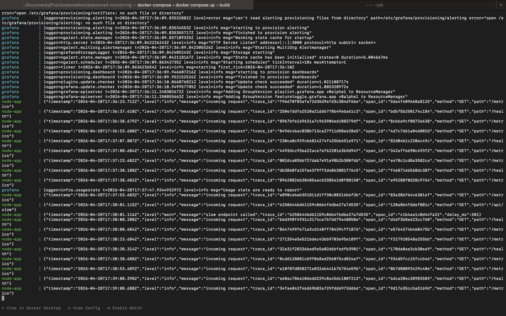

---

## OpenTelemetry Instrumentation

### How tracing.js works

`tracing.js` must be the first `require()` in `server.js`. Node.js caches modules on first load — if Express loads the built-in `http` module before OTel patches it, auto-instrumentation never intercepts requests and you get zero traces.

```js
// server.js
require('./tracing'); // ← must be first
const app = require('./app');
```

`NodeSDK` starts the tracing engine. `getNodeAutoInstrumentations` patches Express, HTTP, DNS, and other built-ins automatically. The OTLP exporter pushes spans to Jaeger over HTTP every few seconds in batches. A `SIGTERM` handler flushes any in-flight spans before the container stops.

### How logger.js injects trace context

OTel stores the current span in Node's `AsyncLocalStorage` for the lifetime of each request. `logger.js` calls `trace.getActiveSpan()` on every log call — if a span is active, `traceId` and `spanId` are extracted and added to the JSON output.

```js
function getTraceContext() {
  const span = trace.getActiveSpan();
  if (!span) return {};
  const ctx = span.spanContext();
  return { trace_id: ctx.traceId, span_id: ctx.spanId };
}
```

Outside of a request (e.g., startup logs), there is no active span and `trace_id` is absent — this is correct behaviour.

### How metrics.js attaches exemplars

prom-client 15.x supports exemplars only on **OpenMetrics registries** — the classic Prometheus text format has no exemplar syntax. The registry is switched with one line:

```js
register.setContentType(client.openMetricsContentType);
```

When exemplars are enabled, `observe()` takes a single object instead of positional arguments:

```js
httpRequestDuration.observe({
  labels,
  value: durationSec,
  exemplarLabels: { traceId: spanCtx.traceId, spanId: spanCtx.spanId },
});
```

Prometheus must be started with `--enable-feature=exemplar-storage` to store and expose exemplar data. Without this flag, exemplars are silently dropped even if the app sends them.

```yaml
# Raw /metrics output — exemplar embedded in histogram bucket line
http_request_duration_seconds_bucket{le="0.5",...} 3 # {traceId="...",spanId="..."} 0.501
```

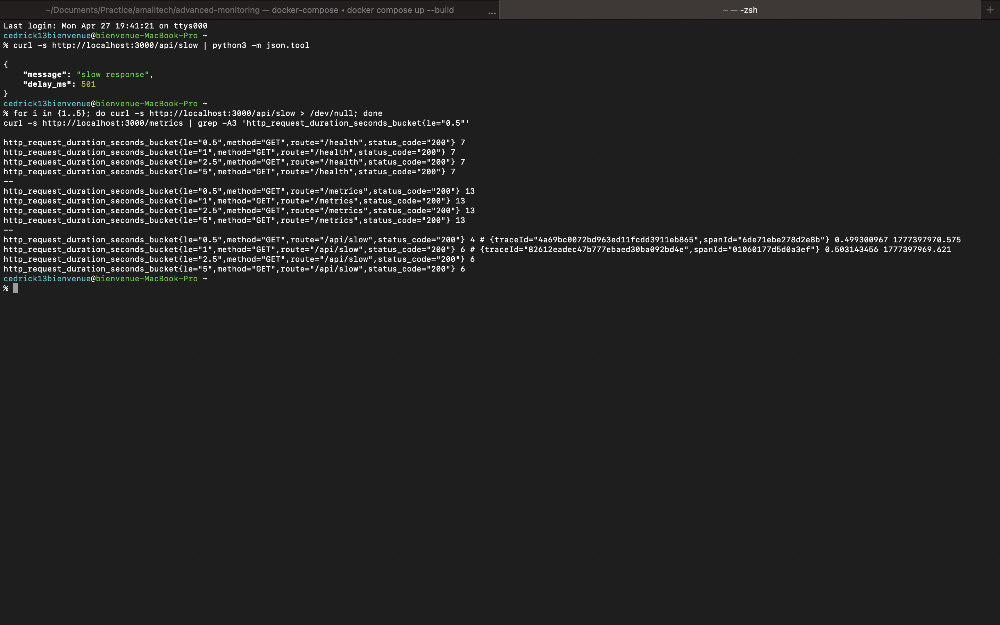

---

## Prometheus

### Targets

Open `http://localhost:9090/targets` — all three scrape jobs must show **UP**:

| Job | Target | What it scrapes |
|---|---|---|
| node-app | app:3000/metrics | RED metrics + process metrics + exemplars |
| node-exporter | node-exporter:9100/metrics | Host CPU, memory, disk, network |
| prometheus | localhost:9090/metrics | Prometheus self-metrics |

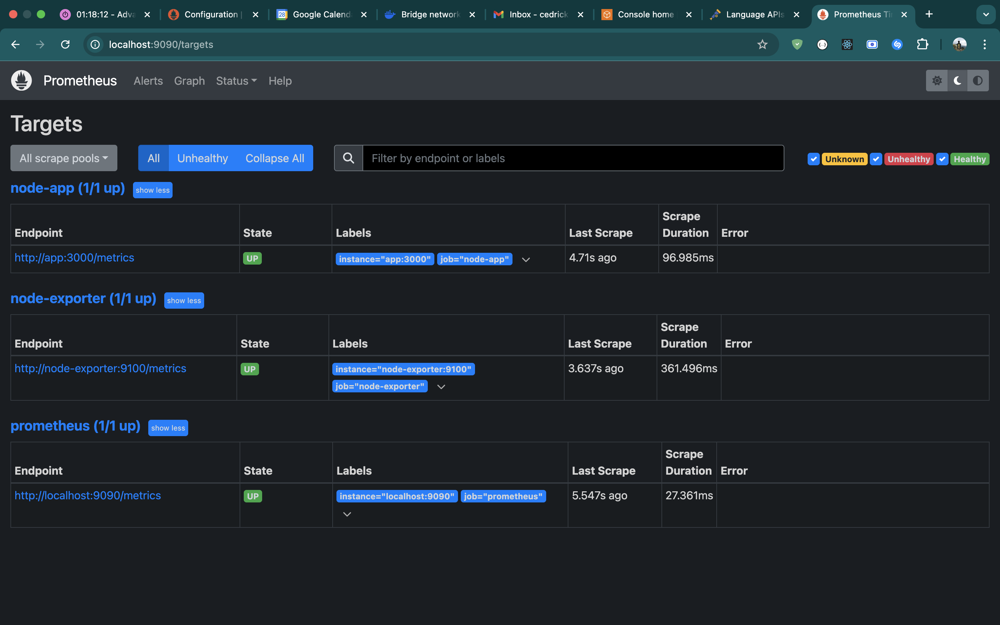

### Alert Rules

Three rules defined in `prometheus/alert_rules.yml`:

| Alert | Condition | Duration | Severity |
|---|---|---|---|
| HighErrorRate | 5xx rate > 5% of total requests | 10 minutes | critical |
| HighLatency | p95 latency > 300ms on any route | 10 minutes | warning |
| AppDown | Prometheus cannot scrape node-app | 1 minute | critical |

The `for: 10m` clause means the condition must be **continuously true for 10 minutes** before the alert fires. A single 5xx response does not trigger it — sustained degradation does.

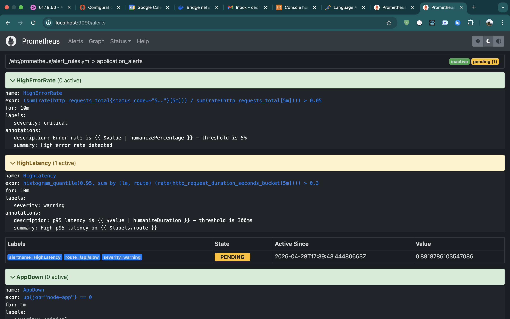

---

## Jaeger Distributed Tracing

Jaeger UI is at `http://localhost:16686`. The app sends traces via OTLP HTTP to `http://jaeger:4318/v1/traces`.

### Viewing traces

1. Select **node-app** from the Service dropdown
2. Click **Find Traces**
3. The trace list shows one entry per request — `GET /api/slow` traces show 300–600ms, `GET /api/items` traces show ~5ms

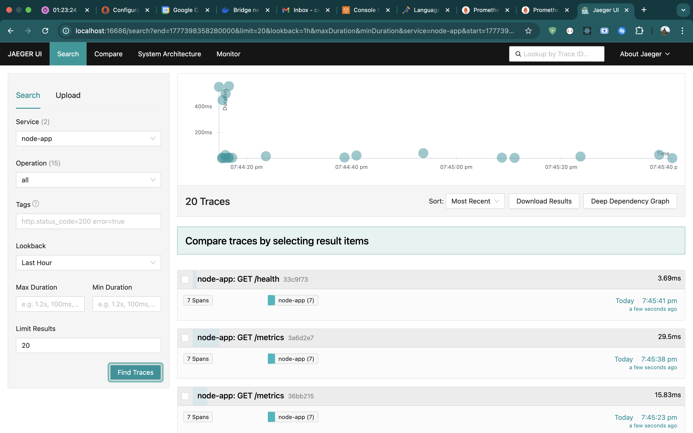

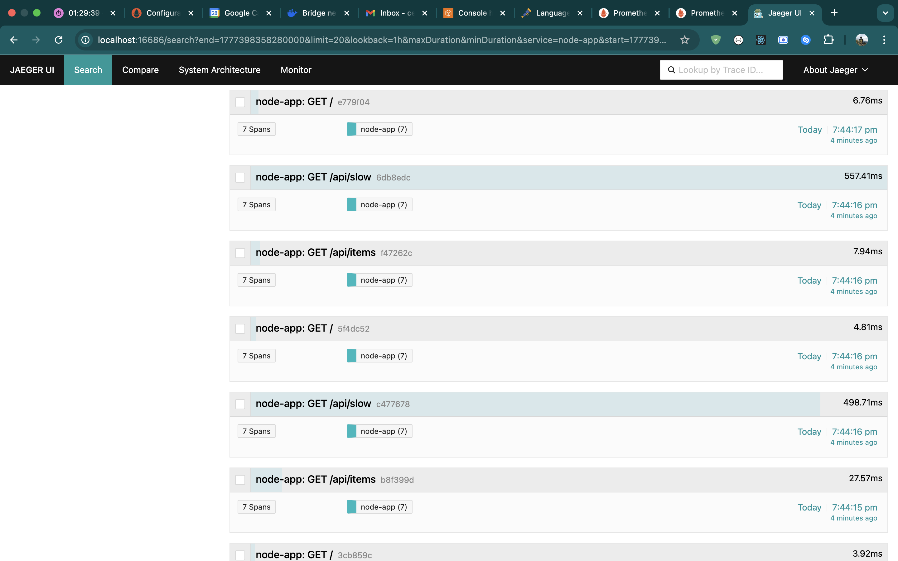

### Reading a trace

Click any `/api/slow` trace. The waterfall shows 7 spans — the root HTTP span and one span per Express middleware layer:

```
GET /api/slow                    510ms  (root span — full request duration)
├── middleware - query            44μs
├── middleware - expressInit     105μs
├── middleware - jsonParser       44μs
├── middleware - metricsMiddleware 31μs
├── middleware - <anonymous>     383μs
└── request handler - /api/slow  508ms  ← where the time was spent
```

The `request handler - /api/slow` span consuming 508ms of 510ms total is the root cause. In a real system this would be a slow DB query or external API call, not an artificial sleep.

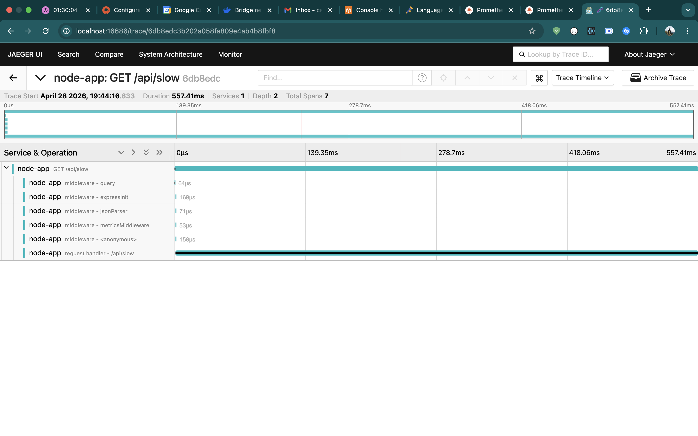

### Span detail

Click the root span. The right panel shows HTTP semantic attributes captured automatically by OTel auto-instrumentation — no manual tagging required:

```
http.method       GET
http.route        /api/slow
http.status_code  200
http.flavor       1.1
net.host.name     localhost
deployment.environment  production
otel.library.name @opentelemetry/instrumentation-http
```

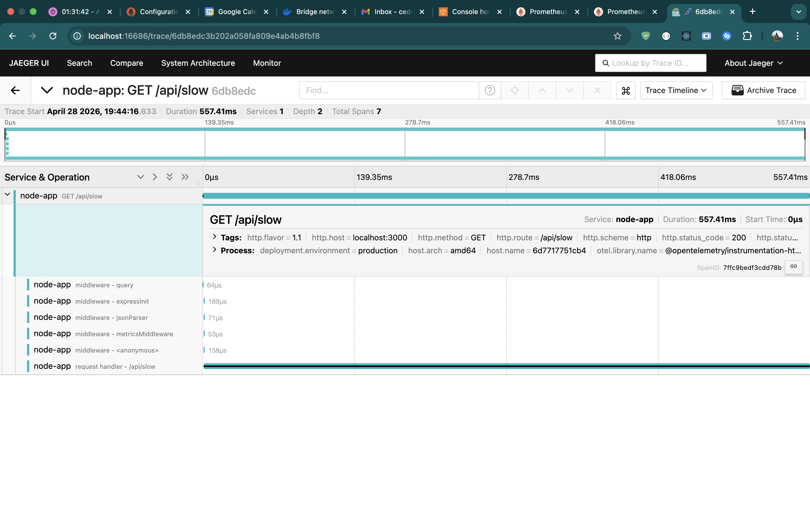

---

## Grafana Dashboard

Open `http://localhost:3001` and log in with the credentials from your `.env` file.

The dashboard auto-loads with four sections:

**Traffic Overview** — four stat panels showing live values:
- Requests/sec — current request rate
- Error Rate — percentage of 5xx responses (red above 5%)
- p95 Latency — 95th percentile latency in milliseconds (red above 300ms)
- App Uptime — seconds since process start

**Request Metrics** — time series showing request rate per route and error rate per route over time.

**Latency + Exemplars** — the p50/p95/p99 latency panel with exemplar diamonds enabled. Each diamond ◆ on the p95 line is a real request whose `traceId` is embedded in the metric sample.

**Distributed Tracing (Jaeger)** — a native Jaeger traces panel that searches the `node-app` service directly inside Grafana without leaving the dashboard.

**System Resources** — CPU usage and memory usage from node-exporter.

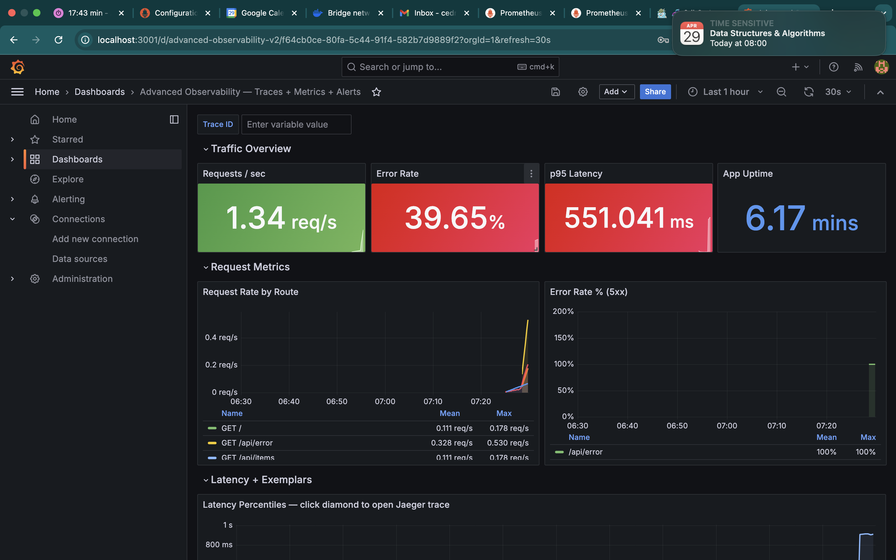
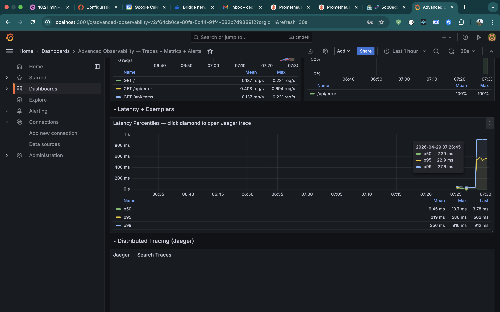

---

## Load Testing & Alert Validation

### Running the load test

```bash
bash load-test.sh
```

The script runs for 13 minutes (780 seconds) — 3 minutes longer than the `for: 10m` alert window to ensure both alerts have time to fire. Each second it sends:

- `GET /` — normal traffic
- `GET /api/items` — normal traffic
- `GET /health` — health check
- `GET /api/slow` — 300–600ms delay, pushes p95 above 300ms threshold
- `GET /api/error` × 3 — always returns 500, creates ~30% error rate (6× above the 5% threshold)

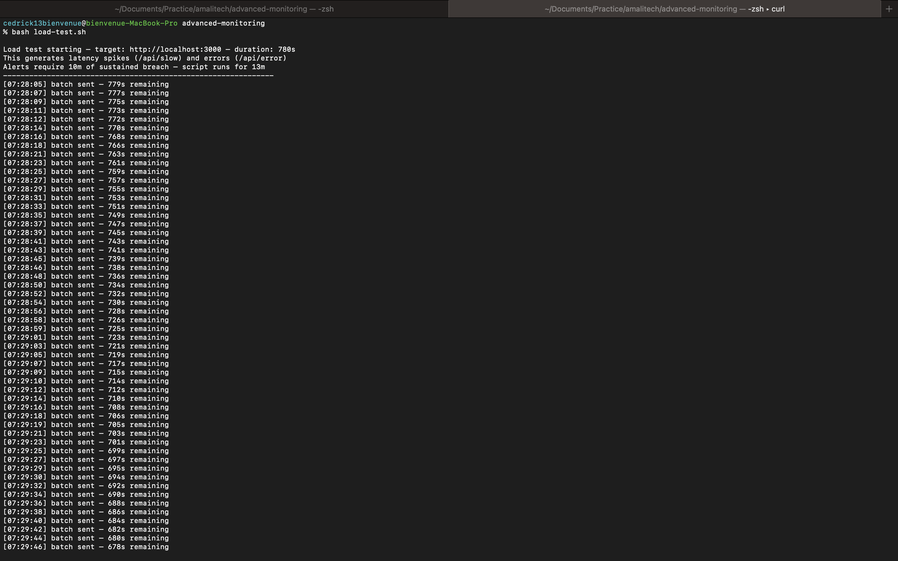

### Alerts firing

After 10 minutes of sustained load, open `http://localhost:9090/alerts`:

- **HighErrorRate** — FIRING — value: 0.396 (39.6% error rate)
- **HighLatency** — FIRING — value: 0.935 (935ms p95 on /api/slow)
- **AppDown** — inactive (app is healthy)

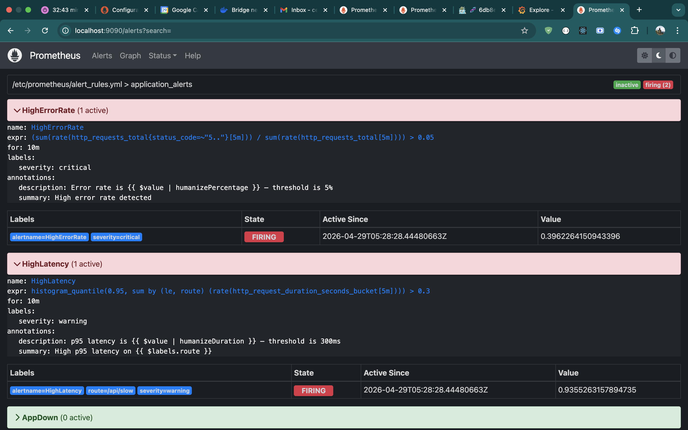

---

## Alert → Trace → Log Correlation

This is the core validation of the lab. Three steps, three tools, one root cause.

### Step 1: Alert → Exemplar → Trace (metric to trace)

On the **Latency Percentiles** panel in Grafana, hover along the p95 line. Small diamond markers ◆ appear — each one is a real request whose `traceId` is stored as an exemplar inside the Prometheus histogram bucket.

Click a diamond. A popup appears showing:

```
traceId    500af4cb4b9d16398974a5251d7b9dbf
spanId     32b9056a07054aab
Value      0.509452248  (509ms)
route      /api/slow
```

Click **Query with Jaeger**. Grafana Explore opens and loads the exact trace.

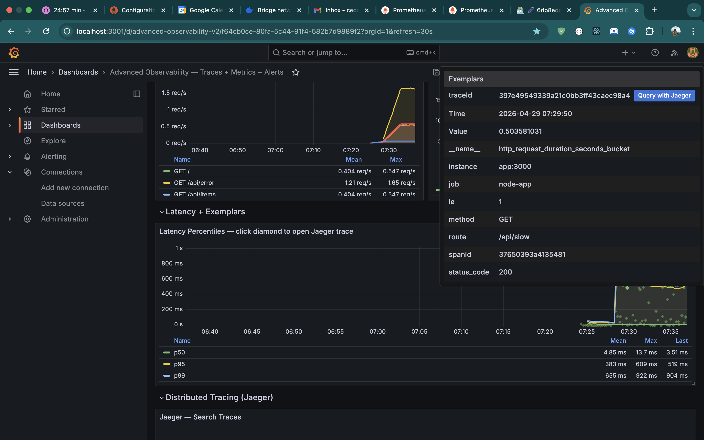

### Step 2: Inside the trace (what ran and how long)

The trace opened in Grafana Explore shows:

```
node-app: GET /api/slow    510ms total
├── middleware - query          44μs
├── middleware - expressInit   105μs
├── middleware - jsonParser      44μs
├── middleware - metricsMiddleware 31μs
├── middleware - <anonymous>   383μs
└── request handler - /api/slow  508ms  ← root cause
```

The `request handler - /api/slow` span took 508ms out of 510ms total. Root cause identified: the artificial `setTimeout` delay in the `/api/slow` route handler.

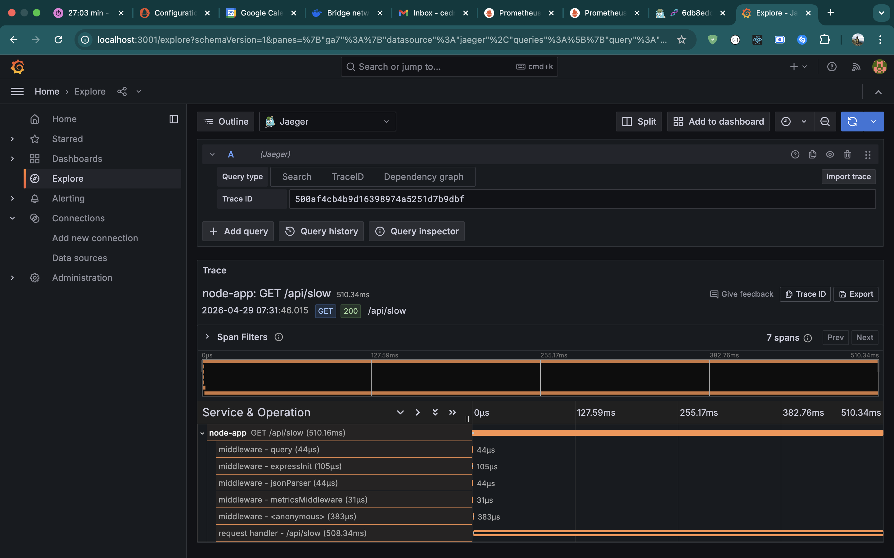

### Step 3: Log → Trace (log line to trace via Loki)

In Grafana Explore → switch datasource to **Loki** → enter the LogQL query:

```
{container="node-app"} | json
```

Loki returns all log lines from the node-app container, parsed as JSON. Each line shows fields including `level`, `trace_id`, `span_id`, `message`, and `path`.

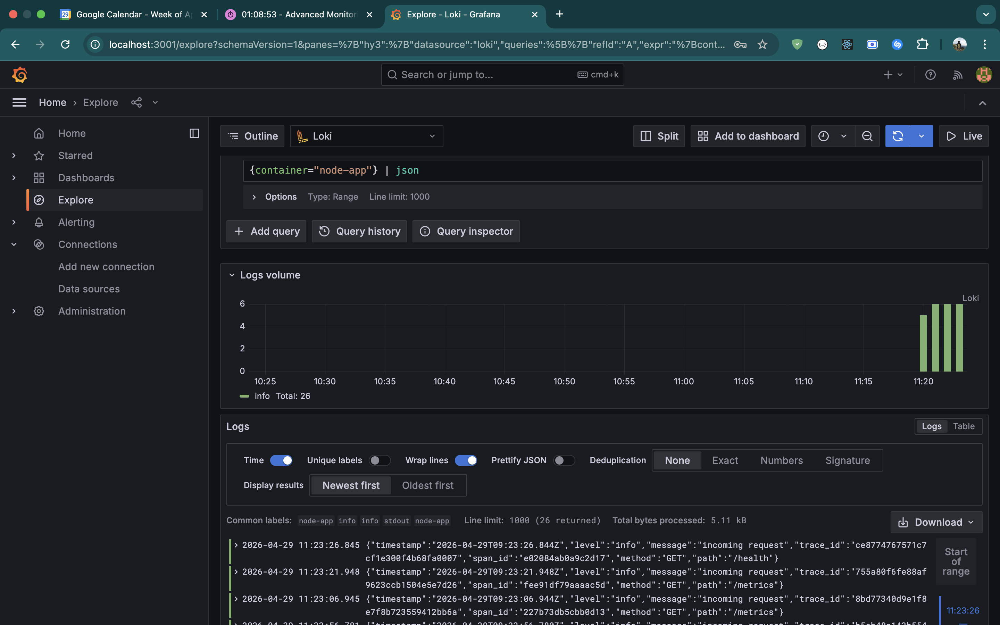

Expanding any log line reveals all parsed JSON fields extracted by Promtail's pipeline stages:

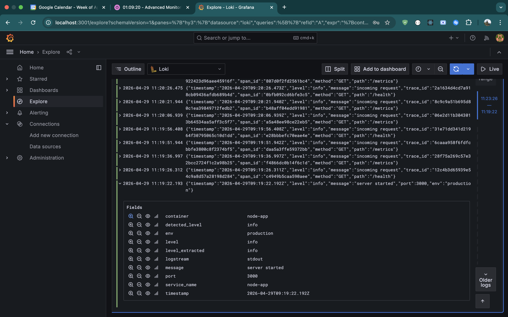

Expand a `"slow endpoint called"` log line. At the bottom of the field list, under **Links**, the `TraceID` derived field appears with the value of `trace_id` extracted by regex — and a **"View Trace in Jaeger"** button next to it:

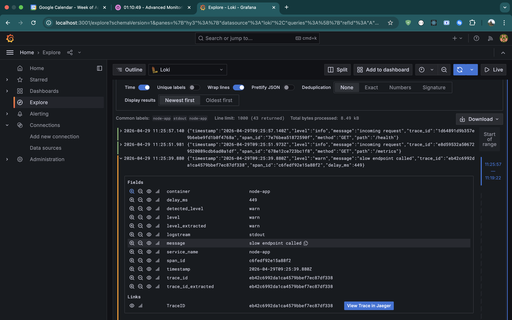

Click **View Trace in Jaeger**. Grafana opens the full Jaeger trace in a split panel — no copy-paste, no tab switch, no manual trace ID entry:

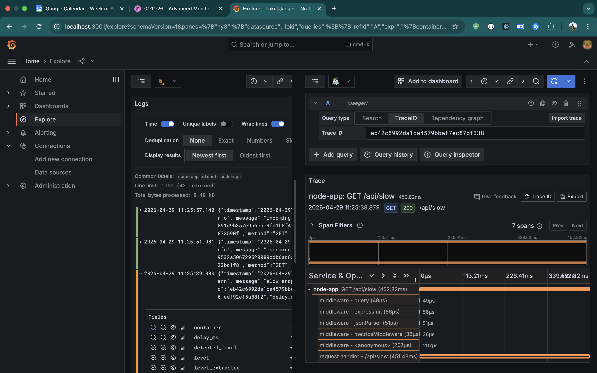

---

## Loki Log Aggregation

### How Promtail works

Promtail mounts `/var/run/docker.sock` read-only so it can query the Docker API for running containers. `docker_sd_configs` discovers all containers automatically — no per-container configuration needed. When a new container starts, Promtail picks it up within the `refresh_interval` (5 seconds).

For each container, Promtail tails the stdout/stderr log stream (the same data you see with `docker logs`). Each log line passes through `pipeline_stages`:

1. **`json` stage** — parses the raw JSON string and extracts `level`, `trace_id`, and `span_id` as structured fields
2. **`labels` stage** — promotes `level` and `trace_id` into Loki label dimensions, making them indexed and filterable

The `relabel_configs` strip the leading `/` from `__meta_docker_container_name` so the `container` label reads `node-app` instead of `/node-app`.

### How Loki stores logs

Loki runs in single-process mode with filesystem storage. Unlike Elasticsearch, Loki does **not** full-text index log content — it indexes only the labels (container, level, trace_id). Log content is stored compressed in chunks. This makes ingest cheap but requires LogQL pipeline operators (`| json`, `| logfmt`) to parse fields at query time.

The `schema_config` uses `tsdb` store with `v13` schema — the current recommended Loki 3.x configuration.

### How `derivedFields` links logs to traces

The Loki datasource in `grafana/provisioning/datasources/datasources.yml` includes:

```yaml
derivedFields:
  - name: TraceID
    matcherRegex: '"trace_id":"([a-f0-9]+)"'
    url: '$${__value.raw}'
    datasourceUid: jaeger
    urlDisplayLabel: View Trace in Jaeger
```

When Grafana renders a log line whose raw text matches `"trace_id":"<hex value>"`, it extracts the hex value via the capture group and renders a **"View Trace in Jaeger"** button. The `url: '$${__value.raw}'` passes the extracted trace ID directly to the Jaeger datasource query. The `datasourceUid: jaeger` tells Grafana which datasource to open — the same `uid` defined on the Jaeger datasource entry.

This means any log line in Loki that contains a `trace_id` field automatically becomes a one-click entry point into the full distributed trace.

---

## Key Design Decisions

**`tracing.js` required before `app.js`** — OTel patches Node's built-in `http` module at load time. If Express loads `http` first, OTel never intercepts it and produces zero traces with no error. The `require('./tracing')` at the top of `server.js` must come before anything else.

**Exemplars require two things to work** — prom-client only attaches exemplars on OpenMetrics registries (`register.setContentType(client.openMetricsContentType)`), and `observe()` with `enableExemplars: true` takes a single `{labels, value, exemplarLabels}` object, not three positional arguments. Either mistake causes exemplars to silently not appear. Prometheus also needs `--enable-feature=exemplar-storage` or it accepts the scrape but discards the data.

**`COPY --chown` instead of `RUN chown -R`** — `RUN chown -R appuser:appgroup /app` traverses every file in `node_modules` at build time, creating a Docker layer that took 70+ seconds on macOS. `COPY --from=builder --chown=appuser:appgroup` sets ownership during the copy with no extra traversal.

**`derivedFields` regex matches the raw log string, not parsed fields** — `matcherRegex` runs against the unparsed log line. The pattern `"trace_id":"([a-f0-9]+)"` must include the JSON key syntax because Grafana hasn't parsed the JSON yet at match time — matching just `([a-f0-9]+)` would catch every hex string in the line.

---

## Investigation Report

A full 2-page investigation report documenting the alert → trace → log correlation workflow with evidence screenshots is available here:

**[REPORT.md — Symptom → Trace → Root Cause](REPORT.md)**

The report covers:
- Both alerts that fired (HighLatency 935ms, HighErrorRate 39.6%)
- How the Prometheus exemplar diamond linked the metric spike to a specific Jaeger trace
- How the Jaeger waterfall identified the exact span (508ms out of 510ms total) as the root cause
- How the `trace_id` from the trace was used to find the corresponding log lines
- Root cause analysis and resolution for both issues

---

## Teardown

Stop and remove all containers and volumes:

```bash
docker compose down -v
```

The `-v` flag removes the named volumes (`prometheus-data`, `grafana-data`, `loki-data`). Omit it if you want to keep the Prometheus metrics history, Grafana configuration, and Loki log index between runs.

Jaeger uses in-memory storage — all trace data is lost when the container stops regardless.
