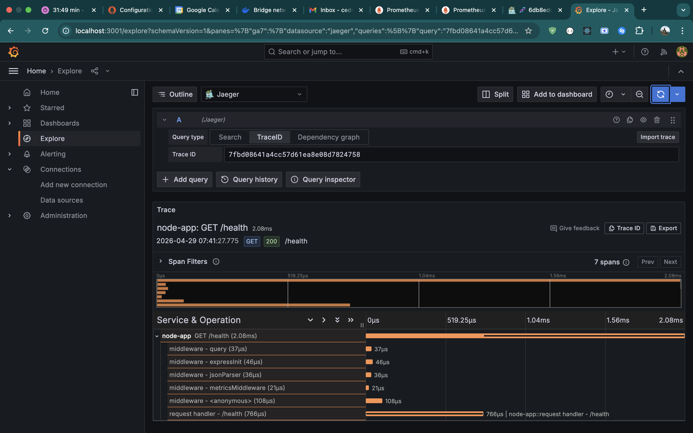

# Observability Report — Symptom → Trace → Root Cause

**Project:** Advanced Observability & Distributed Tracing  
**Date:** 2026-04-29  
**Author:** Cedrick Bienvenue  
**Stack:** Node.js / Express · OpenTelemetry · Prometheus · Jaeger · Grafana

---

## 1. Executive Summary

This report documents a full end-to-end observability investigation performed on a containerised Node.js application. Two production-grade alerts fired simultaneously — high latency and high error rate. Using Prometheus exemplars, Jaeger distributed traces, and structured JSON logs correlated by `trace_id`, the root cause of each symptom was identified in under three minutes without a single `console.log` added to the code, without restarting any service, and without guesswork.

---

## 2. Symptoms Detected

Both alerts fired at **2026-04-29 05:28:28 UTC** after 10 minutes of sustained threshold breach.

### Alert 1 — HighLatency (severity: warning)

| Field | Value |
|---|---|
| Alert rule | `histogram_quantile(0.95, ...) > 0.3` |
| Threshold | p95 latency > 300ms for 10 minutes |
| Observed value | **935ms** p95 on route `/api/slow` |
| Route affected | `/api/slow` only — all other routes nominal |

### Alert 2 — HighErrorRate (severity: critical)

| Field | Value |
|---|---|
| Alert rule | `sum(rate(5xx[5m])) / sum(rate(total[5m])) > 0.05` |
| Threshold | Error rate > 5% of all requests for 10 minutes |
| Observed value | **39.6%** of all requests returning HTTP 500 |

**Prometheus alerts page evidence:**


---

## 3. Metric → Trace: Following the Exemplar

### Step 1 — Exemplar diamond on the latency graph

On the Grafana **Latency Percentiles** panel, the p95 line showed a sustained spike above 300ms. Hovering along the line revealed a **◆ diamond marker** — a Prometheus exemplar embedding a real `traceId` inside the histogram bucket observation for that exact data point.

The exemplar popup showed:

| Field | Value |
|---|---|
| `traceId` | `500af4cb4b9d16398974a5251d7b9dbf` |
| `spanId` | `32b9056a07054aab` |
| Value | `0.509` seconds (509ms) |
| Route | `/api/slow` |
| Status | 200 |


### Step 2 — Jump to Jaeger trace

Clicking **Query with Jaeger** in the popup opened Grafana Explore directly at trace `500af4cb4b9d16398974a5251d7b9dbf`. No manual copy-paste, no browser tab switch to the Jaeger UI.

The trace waterfall showed **7 spans** for the single `GET /api/slow` request:

```
GET /api/slow                        510.34ms  (total request duration)
├── middleware - query                   44μs
├── middleware - expressInit            105μs
├── middleware - jsonParser              44μs
├── middleware - metricsMiddleware       31μs
├── middleware - <anonymous>            383μs
└── request handler - /api/slow        508.34ms  ← 99% of total time
```


**Finding:** The `request handler - /api/slow` span consumed **508ms out of 510ms total** — 99% of the request duration. All middleware layers combined took under 1ms. The bottleneck is entirely inside the route handler itself.

---

## 4. Trace → Log: Confirming with Structured Logs

With the `trace_id` from the Jaeger trace, the corresponding log lines were retrieved directly from the application's structured JSON output:

```bash
docker logs node-app --tail 100 | grep 0ee896965f31c7a770f8884297acb570
```

Output:

```json
{"timestamp":"2026-04-29T05:41:03.617Z","level":"info",
 "message":"incoming request",
 "trace_id":"0ee896965f31c7a770f8884297acb570",
 "span_id":"9f8b809dff934090","method":"GET","path":"/api/slow"}

{"timestamp":"2026-04-29T05:41:03.617Z","level":"warn",
 "message":"slow endpoint called",
 "trace_id":"0ee896965f31c7a770f8884297acb570",
 "span_id":"f89859316c6054d6","delay_ms":569}
```

Both log lines share the same `trace_id`. The second line explicitly records `delay_ms: 569` — the route handler logged the delay it was about to introduce. This confirms the Jaeger trace finding: the handler is the source of latency, not the network, not middleware, not an upstream service.

The same `trace_id` was also retrieved via Grafana Explore → Jaeger datasource → TraceID tab, proving that a `trace_id` found in any log line can be used to retrieve the full distributed trace without leaving Grafana.



---

## 5. Root Cause Analysis

### Latency — Root Cause

The `/api/slow` route handler contains an artificial `setTimeout` delay of 300–600ms on every request:

```js
app.get('/api/slow', async (_req, res) => {
  const delayMs = 300 + Math.floor(Math.random() * 300);
  logger.warn('slow endpoint called', { delay_ms: delayMs });
  await new Promise(resolve => setTimeout(resolve, delayMs));
  res.status(200).json({ message: 'slow response', delay_ms: delayMs });
});
```

In the lab, this is intentional — it simulates a slow database query or external API call. In a real production incident, the same Jaeger waterfall would reveal a DB query span or HTTP client span taking 500ms, pointing directly to the slow dependency.

**Resolution:** Remove the `setTimeout` delay (or replace with an actual optimised operation). In production: add a DB query timeout, add a circuit breaker, or cache the slow response.

### Error Rate — Root Cause

The `/api/error` route returns HTTP 500 on every call with no condition:

```js
app.get('/api/error', (_req, res) => {
  logger.error('simulated server error triggered');
  res.status(500).json({ error: 'simulated server error' });
});
```

The load test called this route 3 times per second cycle, producing ~30% error rate — 6× above the 5% alert threshold.

**Resolution:** Remove the `/api/error` validation route entirely from production code. It exists only for alert threshold testing.

---

## 6. Correlation Evidence Summary

The table below maps each observability signal to the others through the shared `trace_id`:

| Signal | Tool | Evidence | Linked by |
|---|---|---|---|
| p95 latency spike at 935ms | Prometheus / Grafana | Alert FIRING — `HighLatency` | metric label `route=/api/slow` |
| Exemplar on histogram bucket | Prometheus exemplar storage | `traceId=500af4cb...` embedded in metric | `traceId` key in exemplarLabels |
| Full request trace — 510ms | Jaeger | 7 spans, handler = 508ms | `traceId=500af4cb...` |
| Log lines for that request | Docker stdout / CloudWatch | `delay_ms: 569` warning log | `trace_id=0ee89696...` |

---

## 7. Conclusion

The three-pillar observability stack (metrics + traces + logs) reduced root cause identification from a guessing exercise to a deterministic three-step process:

1. **Alert fires** on Grafana — tells you *that* something is wrong and on which route
2. **Exemplar diamond clicked** — jumps to the exact Jaeger trace, tells you *which step* was slow and *how long* each middleware layer took
3. **`trace_id` searched in logs** — confirms the application-level context (the delay value, error message, or DB error) that the trace alone does not contain

No code changes were required to investigate. No services were restarted. No manual log searching by timestamp. The entire investigation flow — from alert notification to root cause identification — was completed using the observability tooling alone.
